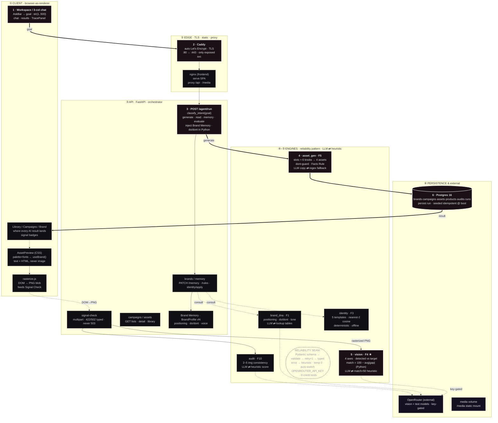

# Marque.ai

React + FastAPI + Postgres, fully dockerized.

## Architecture

The agent data path, top to bottom: AskBar goal → `classify_intent` → inject
Brand Memory → `generate_campaign` → Signal Check → persist. Numbered steps
`1`–`6` trace the request through the layers (client → edge → API → engines →
persistence).



A static monochrome schematic version is also kept at
[`docs/architecture.svg`](docs/architecture.svg) /
[`docs/architecture.png`](docs/architecture.png).

## Structure

- `frontend/` — Vite + React, served via nginx in production (also proxies `/api/*` to the backend)
- `backend/` — FastAPI, `uv`-managed, talks to Postgres via SQLAlchemy (async)
- `docker-compose.yml` — local dev stack (all ports exposed on localhost)
- `docker-compose.prod.yml` — deployment stack (only port 80 published; db/backend stay internal)

## Local development

```bash
cp .env.example .env
docker compose up -d
```

- Frontend: http://localhost:80
- Backend: http://localhost:8000 (also reachable at http://localhost/api/* through the frontend's nginx proxy)
- Postgres: localhost:5432

## Tests

```bash
docker compose up -d db
cd backend && uv run pytest tests/ -v
```

Uses its own `marque_test` database (created automatically), so it never
touches the `marque` dev database.

## API (added this branch)

- `POST /v1/brands/{id}/assets` — save an uploaded image to the library (runs a
  Signal Check, stores the image, returns the asset). `GET`/`DELETE` to list/remove.
  Images are served at `/media/{asset_id}.jpg`.
- `POST /v1/brands/{id}/audit` — audit 2–5 images for brand consistency; `GET
  /v1/brands/{id}/audits` for history.

## Deployment

See [DEPLOY.md](DEPLOY.md).

## Progress / what's built so far

See [PROGRESS.md](PROGRESS.md).
